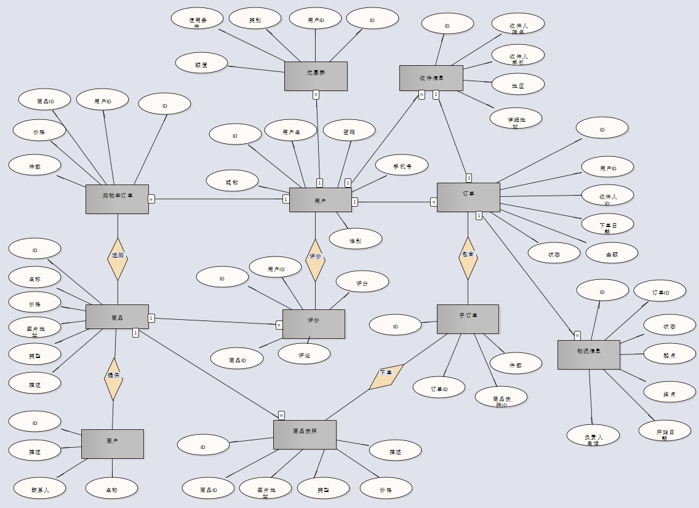

# 第六周作业

## 周四第二题

- ERD - eshop.jpg



- DDL - eshop.sql

``` sql
/* ---------------------------------------------------- */
/*  Generated by Enterprise Architect Version 14.0         */
/*  Created On : 25-11ÔÂ-2020 23:28:24                 */
/*  DBMS       : MySql                         */
/* ---------------------------------------------------- */

SET FOREIGN_KEY_CHECKS=0
; 
/* Drop Tables */

DROP TABLE IF EXISTS `cart_item` CASCADE
;

DROP TABLE IF EXISTS `client` CASCADE
;

DROP TABLE IF EXISTS `commodity` CASCADE
;

DROP TABLE IF EXISTS `commodity_comment` CASCADE
;

DROP TABLE IF EXISTS `commodity_snapshot` CASCADE
;

DROP TABLE IF EXISTS `logistics` CASCADE
;

DROP TABLE IF EXISTS `order` CASCADE
;

DROP TABLE IF EXISTS `order_item` CASCADE
;

DROP TABLE IF EXISTS `receipt_address` CASCADE
;

DROP TABLE IF EXISTS `shop` CASCADE
;

/* Create Tables */

CREATE TABLE `cart_item`
(
    `id` BIGINT NOT NULL AUTO_INCREMENT,
    `client_id` BIGINT NOT NULL COMMENT '用户id',
    `commodity_id` BIGINT NOT NULL COMMENT '商品id',
    `amount` TINYINT NOT NULL COMMENT '商品件数',
    `total_price` INT NOT NULL COMMENT '总价',
    `create_time` TIMESTAMP NOT NULL DEFAULT CURRENT_TIMESTAMP COMMENT '创建时间',
    `update_time` TIMESTAMP NOT NULL DEFAULT CURRENT_TIMESTAMP ON UPDATE CURRENT_TIMESTAMP COMMENT '更新时间',
    `is_deleted` TINYINT NOT NULL DEFAULT 0 COMMENT '是否已删除',
    CONSTRAINT `PK_cart_item` PRIMARY KEY (`id` ASC)
) COMMENT '购物车订单'

;

CREATE TABLE `client`
(
    `id` BIGINT NOT NULL AUTO_INCREMENT,
    `username` VARCHAR(20) NOT NULL COMMENT '用户名',
    `password` VARCHAR(50) NOT NULL COMMENT '密码',
    `phone` VARCHAR(20) NOT NULL COMMENT '手机号',
    `gender` TINYINT NOT NULL DEFAULT 0 COMMENT '性别',
    `nickname` VARCHAR(20) NOT NULL COMMENT '昵称',
    `create_time` TIMESTAMP NOT NULL DEFAULT CURRENT_TIMESTAMP COMMENT '创建时间',
    `update_time` TIMESTAMP NOT NULL DEFAULT CURRENT_TIMESTAMP ON UPDATE CURRENT_TIMESTAMP COMMENT '更新时间',
    `is_deleted` TINYINT NOT NULL DEFAULT 0 COMMENT '是否已删除',
    CONSTRAINT `PK_client` PRIMARY KEY (`id` ASC)
) COMMENT '用户信息'

;

CREATE TABLE `commodity`
(
    `id` BIGINT NOT NULL AUTO_INCREMENT,
    `shop_id` BIGINT NOT NULL COMMENT '店铺id',
    `name` VARCHAR(50) NOT NULL COMMENT '商品名称',
    `price` INT NOT NULL COMMENT '价格',
    `type` VARCHAR(20) NOT NULL COMMENT '商品类型',
    `introduction` VARCHAR(200) NOT NULL COMMENT '商品介绍',
    `create_time` TIMESTAMP NOT NULL DEFAULT CURRENT_TIMESTAMP COMMENT '创建时间',
    `update_time` TIMESTAMP NOT NULL DEFAULT CURRENT_TIMESTAMP ON UPDATE CURRENT_TIMESTAMP COMMENT '更新时间',
    `is_deleted` TINYINT NOT NULL DEFAULT 0 COMMENT '是否已删除',
    CONSTRAINT `PK_commodity` PRIMARY KEY (`id` ASC)
) COMMENT '商品信息'

;

CREATE TABLE `commodity_comment`
(
    `id` BIGINT NOT NULL AUTO_INCREMENT,
    `commodity_id` BIGINT NOT NULL COMMENT '商品id',
    `client_id` BIGINT NOT NULL COMMENT '用户id',
    `score` TINYINT NOT NULL COMMENT '评分',
    `comment` VARCHAR(200) NOT NULL COMMENT '评价',
    `create_time` TIMESTAMP NOT NULL DEFAULT CURRENT_TIMESTAMP COMMENT '创建时间',
    `update_time` TIMESTAMP NOT NULL DEFAULT CURRENT_TIMESTAMP ON UPDATE CURRENT_TIMESTAMP COMMENT '更新时间',
    `is_deleted` TINYINT NOT NULL DEFAULT 0 COMMENT '是否已删除',
    CONSTRAINT `PK_commodity_comment` PRIMARY KEY (`id` ASC)
) COMMENT '商品评价'

;

CREATE TABLE `commodity_snapshot`
(
    `id` BIGINT NOT NULL AUTO_INCREMENT,
    `commodity_id` BIGINT NOT NULL COMMENT '商品id',
    `shop_id` BIGINT NOT NULL  COMMENT '店铺id',
    `name` VARCHAR(50) NOT NULL COMMENT '商品名称',
    `price` INT NOT NULL COMMENT '商品价格',
    `type` VARCHAR(20) NOT NULL COMMENT '商品类型',
    `introduction` VARCHAR(200) NOT NULL COMMENT '商品介绍',
    `create_time` TIMESTAMP NOT NULL DEFAULT CURRENT_TIMESTAMP COMMENT '创建时间',
    `update_time` TIMESTAMP NOT NULL DEFAULT CURRENT_TIMESTAMP ON UPDATE CURRENT_TIMESTAMP COMMENT '更新时间',
    `is_deleted` TINYINT NOT NULL DEFAULT 0 COMMENT '是否已删除',
    CONSTRAINT `PK_commodity` PRIMARY KEY (`id` ASC)
) COMMENT '商品快照'

;

CREATE TABLE `logistics`
(
    `id` BIGINT NOT NULL AUTO_INCREMENT,
    `order_id` BIGINT NOT NULL COMMENT '订单id',
    `status` VARCHAR(20) NOT NULL COMMENT '物流状态',
    `from` VARCHAR(50) NOT NULL COMMENT '起点',
    `to` VARCHAR(50) NOT NULL COMMENT '终点',
    `manager` VARCHAR(20) NOT NULL COMMENT '负责人',
    `message` VARCHAR(50) NOT NULL COMMENT '消息',
    `create_time` TIMESTAMP NOT NULL DEFAULT CURRENT_TIMESTAMP COMMENT '创建时间',
    `update_time` TIMESTAMP NOT NULL DEFAULT CURRENT_TIMESTAMP ON UPDATE CURRENT_TIMESTAMP COMMENT '更新时间',
    `is_deleted` TINYINT NOT NULL DEFAULT 0 COMMENT '是否已删除',
    CONSTRAINT `PK_logistics` PRIMARY KEY (`id` ASC)
) COMMENT '物流信息'

;

CREATE TABLE `order`
(
    `id` BIGINT NOT NULL AUTO_INCREMENT,
    `client_id` BIGINT NOT NULL COMMENT '用户id',
    `receipt_address_id` BIGINT NOT NULL COMMENT '收件地址id',
    `total_price` INT NOT NULL COMMENT '总支付价格',
    `discount_price` INT NOT NULL COMMENT '折扣价格',
    `status` TINYINT NOT NULL DEFAULT 0 COMMENT '订单状态',
    `create_time` TIMESTAMP NOT NULL DEFAULT CURRENT_TIMESTAMP COMMENT '创建时间',
    `update_time` TIMESTAMP NOT NULL DEFAULT CURRENT_TIMESTAMP ON UPDATE CURRENT_TIMESTAMP COMMENT '更新时间',
    `is_deleted` TINYINT NOT NULL DEFAULT 0 COMMENT '是否已删除',
    CONSTRAINT `PK_order` PRIMARY KEY (`id` ASC)
) COMMENT '订单信息'

;

CREATE TABLE `order_item`
(
    `id` BIGINT NOT NULL AUTO_INCREMENT,
    `order_id` BIGINT NOT NULL COMMENT '订单id',
    `commodity_snapshot_id` BIGINT NOT NULL COMMENT '商品快照id',
    `amount` INT NOT NULL COMMENT '商品件数',
    `create_time` TIMESTAMP NOT NULL DEFAULT CURRENT_TIMESTAMP COMMENT '创建时间',
    `update_time` TIMESTAMP NOT NULL DEFAULT CURRENT_TIMESTAMP ON UPDATE CURRENT_TIMESTAMP COMMENT '更新时间',
    `is_deleted` TINYINT NOT NULL DEFAULT 0 COMMENT '是否已删除',
    CONSTRAINT `PK_order_item` PRIMARY KEY (`id` ASC)
) COMMENT '子订单信息'

;

CREATE TABLE `receipt_address`
(
    `id` BIGINT NOT NULL AUTO_INCREMENT,
    `client_id` BIGINT NOT NULL COMMENT '用户id',
    `addressee` VARCHAR(20) NOT NULL COMMENT '收件人姓名',
    `phone` VARCHAR(20) NOT NULL COMMENT '收件人电话',
    `province` VARCHAR(10) NOT NULL COMMENT '省',
    `city` VARCHAR(10) NOT NULL COMMENT '市',
    `district` VARCHAR(10) NOT NULL COMMENT '区县',
    `street` VARCHAR(30) NOT NULL COMMENT '镇/街道',
    `adress` VARCHAR(30) NOT NULL COMMENT '地址',
    `create_time` TIMESTAMP NOT NULL DEFAULT CURRENT_TIMESTAMP COMMENT '创建时间',
    `update_time` TIMESTAMP NOT NULL DEFAULT CURRENT_TIMESTAMP ON UPDATE CURRENT_TIMESTAMP COMMENT '更新时间',
    `is_deleted` TINYINT NOT NULL DEFAULT 0 COMMENT '是否已删除',
    CONSTRAINT `PK_receipt_address` PRIMARY KEY (`id` ASC)
) COMMENT '收件人信息'

;

CREATE TABLE `shop`
(
    `id` BIGINT NOT NULL AUTO_INCREMENT,
    `name` VARCHAR(20) NOT NULL COMMENT '店铺名称',
    `manager` VARCHAR(20) NOT NULL COMMENT '负责人',
    `introduction` VARCHAR(200) NOT NULL COMMENT '店铺介绍',
    `create_time` TIMESTAMP NOT NULL DEFAULT CURRENT_TIMESTAMP COMMENT '创建时间',
    `update_time` TIMESTAMP NOT NULL DEFAULT CURRENT_TIMESTAMP ON UPDATE CURRENT_TIMESTAMP COMMENT '更新时间',
    `is_deleted` TINYINT NOT NULL DEFAULT 0 COMMENT '是否已删除',
    CONSTRAINT `PK_shop` PRIMARY KEY (`id` ASC)
) COMMENT '店铺信息'

;

SET FOREIGN_KEY_CHECKS=1
; 

```